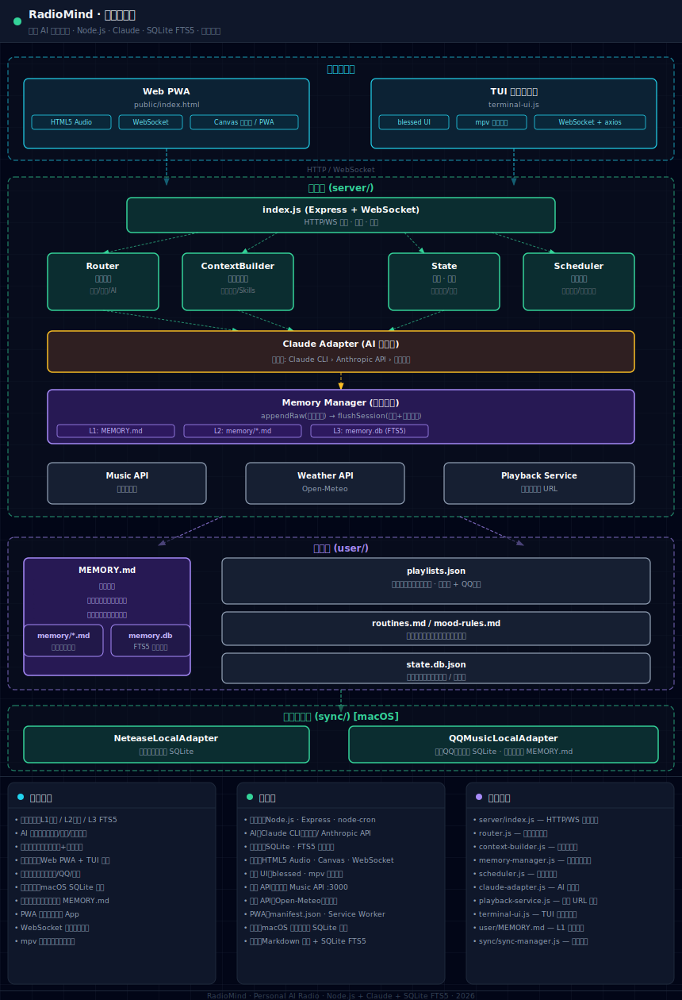

# RadioMind 🎵

个人 AI 音乐电台 —— 懂你的 AI DJ

## 演示

<div align="center">

### TUI 终端界面

https://github.com/user-attachments/assets/8ca5f3b2-d77c-4bf4-b72a-10dacf9ef1e8

### Web GUI 界面

https://github.com/user-attachments/assets/ea69b9ec-9129-4590-8ab7-9630f0b58da0

</div>

## 架构图

<div align="center">



<!--SVG_START
<svg viewBox="0 0 860 920" width="860" xmlns="http://www.w3.org/2000/svg" style="font-family:ui-monospace,SFMono-Regular,Menlo,monospace;background:#0d1117;border-radius:12px;padding:8px">
  <defs>
    <marker id="arr" markerWidth="8" markerHeight="6" refX="7" refY="3" orient="auto">
      <polygon points="0 0,8 3,0 6" fill="#58a6ff"/>
    </marker>
    <marker id="arr-g" markerWidth="8" markerHeight="6" refX="7" refY="3" orient="auto">
      <polygon points="0 0,8 3,0 6" fill="#3fb950"/>
    </marker>
    <marker id="arr-v" markerWidth="8" markerHeight="6" refX="7" refY="3" orient="auto">
      <polygon points="0 0,8 3,0 6" fill="#a371f7"/>
    </marker>
  </defs>

  <!-- ── 用户界面层 ── -->
  <rect x="10" y="10" width="840" height="130" rx="8" fill="#161b22" stroke="#58a6ff" stroke-width="1.5" stroke-dasharray="6,3"/>
  <text x="430" y="30" fill="#58a6ff" font-size="12" font-weight="600" text-anchor="middle">用户界面层</text>

  <!-- Web PWA -->
  <rect x="30" y="38" width="360" height="88" rx="6" fill="#0d419d" fill-opacity="0.3" stroke="#58a6ff" stroke-width="1.2"/>
  <text x="210" y="58" fill="#79c0ff" font-size="11" font-weight="600" text-anchor="middle">Web PWA</text>
  <text x="210" y="74" fill="#8b949e" font-size="9" text-anchor="middle">public/index.html</text>
  <rect x="40" y="84" width="100" height="18" rx="3" fill="#1f6feb" fill-opacity="0.4" stroke="#58a6ff" stroke-width="0.8"/>
  <text x="90" y="96" fill="#79c0ff" font-size="8" text-anchor="middle">HTML5 Audio</text>
  <rect x="150" y="84" width="80" height="18" rx="3" fill="#1f6feb" fill-opacity="0.4" stroke="#58a6ff" stroke-width="0.8"/>
  <text x="190" y="96" fill="#79c0ff" font-size="8" text-anchor="middle">WebSocket</text>
  <rect x="240" y="84" width="136" height="18" rx="3" fill="#1f6feb" fill-opacity="0.4" stroke="#58a6ff" stroke-width="0.8"/>
  <text x="308" y="96" fill="#79c0ff" font-size="8" text-anchor="middle">Canvas 可视化 / PWA</text>

  <!-- TUI -->
  <rect x="468" y="38" width="360" height="88" rx="6" fill="#0d419d" fill-opacity="0.3" stroke="#58a6ff" stroke-width="1.2"/>
  <text x="648" y="58" fill="#79c0ff" font-size="11" font-weight="600" text-anchor="middle">TUI 终端播放器</text>
  <text x="648" y="74" fill="#8b949e" font-size="9" text-anchor="middle">terminal-ui.js</text>
  <rect x="478" y="84" width="88" height="18" rx="3" fill="#1f6feb" fill-opacity="0.4" stroke="#58a6ff" stroke-width="0.8"/>
  <text x="522" y="96" fill="#79c0ff" font-size="8" text-anchor="middle">blessed UI</text>
  <rect x="576" y="84" width="88" height="18" rx="3" fill="#1f6feb" fill-opacity="0.4" stroke="#58a6ff" stroke-width="0.8"/>
  <text x="620" y="96" fill="#79c0ff" font-size="8" text-anchor="middle">mpv 本地播放</text>
  <rect x="674" y="84" width="140" height="18" rx="3" fill="#1f6feb" fill-opacity="0.4" stroke="#58a6ff" stroke-width="0.8"/>
  <text x="744" y="96" fill="#79c0ff" font-size="8" text-anchor="middle">WebSocket + axios</text>

  <!-- 箭头 UI → 服务层 -->
  <line x1="210" y1="126" x2="210" y2="172" stroke="#58a6ff" stroke-width="1.2" stroke-dasharray="4,2" marker-end="url(#arr)"/>
  <line x1="648" y1="126" x2="648" y2="172" stroke="#58a6ff" stroke-width="1.2" stroke-dasharray="4,2" marker-end="url(#arr)"/>
  <text x="430" y="156" fill="#8b949e" font-size="9" text-anchor="middle">HTTP / WebSocket</text>

  <!-- ── 服务层 ── -->
  <rect x="10" y="162" width="840" height="428" rx="8" fill="#161b22" stroke="#3fb950" stroke-width="1.5" stroke-dasharray="6,3"/>
  <text x="430" y="180" fill="#3fb950" font-size="12" font-weight="600" text-anchor="middle">服务层 (server/)</text>

  <!-- index.js 网关 -->
  <rect x="160" y="188" width="540" height="44" rx="6" fill="#1a4731" fill-opacity="0.5" stroke="#3fb950" stroke-width="1.2"/>
  <text x="430" y="207" fill="#56d364" font-size="11" font-weight="600" text-anchor="middle">index.js  (Express + WebSocket)</text>
  <text x="430" y="222" fill="#8b949e" font-size="9" text-anchor="middle">HTTP/WS 网关 · 路由 · 广播</text>

  <!-- 箭头 网关 → 4组件 -->
  <line x1="250" y1="232" x2="130" y2="258" stroke="#3fb950" stroke-width="1" stroke-dasharray="3,2" marker-end="url(#arr-g)"/>
  <line x1="350" y1="232" x2="305" y2="258" stroke="#3fb950" stroke-width="1" stroke-dasharray="3,2" marker-end="url(#arr-g)"/>
  <line x1="510" y1="232" x2="535" y2="258" stroke="#3fb950" stroke-width="1" stroke-dasharray="3,2" marker-end="url(#arr-g)"/>
  <line x1="620" y1="232" x2="700" y2="258" stroke="#3fb950" stroke-width="1" stroke-dasharray="3,2" marker-end="url(#arr-g)"/>

  <!-- 4个核心组件 -->
  <rect x="60" y="258" width="140" height="72" rx="6" fill="#1a4731" fill-opacity="0.4" stroke="#3fb950" stroke-width="1.2"/>
  <text x="130" y="278" fill="#56d364" font-size="10" font-weight="600" text-anchor="middle">Router</text>
  <text x="130" y="293" fill="#8b949e" font-size="9" text-anchor="middle">意图分流</text>
  <text x="130" y="308" fill="#6e7681" font-size="8" text-anchor="middle">指令/搜索/AI</text>

  <rect x="230" y="258" width="140" height="72" rx="6" fill="#1a4731" fill-opacity="0.4" stroke="#3fb950" stroke-width="1.2"/>
  <text x="300" y="278" fill="#56d364" font-size="10" font-weight="600" text-anchor="middle">ContextBuilder</text>
  <text x="300" y="293" fill="#8b949e" font-size="9" text-anchor="middle">提示词组装</text>
  <text x="300" y="308" fill="#6e7681" font-size="8" text-anchor="middle">记忆注入/Skills</text>

  <rect x="490" y="258" width="140" height="72" rx="6" fill="#1a4731" fill-opacity="0.4" stroke="#3fb950" stroke-width="1.2"/>
  <text x="560" y="278" fill="#56d364" font-size="10" font-weight="600" text-anchor="middle">State</text>
  <text x="560" y="293" fill="#8b949e" font-size="9" text-anchor="middle">状态 · 记忆</text>
  <text x="560" y="308" fill="#6e7681" font-size="8" text-anchor="middle">播放历史/偏好</text>

  <rect x="660" y="258" width="140" height="72" rx="6" fill="#1a4731" fill-opacity="0.4" stroke="#3fb950" stroke-width="1.2"/>
  <text x="730" y="278" fill="#56d364" font-size="10" font-weight="600" text-anchor="middle">Scheduler</text>
  <text x="730" y="293" fill="#8b949e" font-size="9" text-anchor="middle">节律调度</text>
  <text x="730" y="308" fill="#6e7681" font-size="8" text-anchor="middle">定时推荐/品味更新</text>

  <!-- 箭头 → Claude Adapter -->
  <line x1="130" y1="330" x2="300" y2="356" stroke="#3fb950" stroke-width="1" stroke-dasharray="3,2" marker-end="url(#arr-g)"/>
  <line x1="300" y1="330" x2="370" y2="356" stroke="#3fb950" stroke-width="1" stroke-dasharray="3,2" marker-end="url(#arr-g)"/>
  <line x1="560" y1="330" x2="490" y2="356" stroke="#3fb950" stroke-width="1" stroke-dasharray="3,2" marker-end="url(#arr-g)"/>

  <!-- Claude Adapter -->
  <rect x="60" y="356" width="740" height="52" rx="6" fill="#3d1f00" fill-opacity="0.6" stroke="#e3b341" stroke-width="1.5"/>
  <text x="430" y="376" fill="#e3b341" font-size="11" font-weight="600" text-anchor="middle">Claude Adapter  (AI 适配器)</text>
  <text x="430" y="395" fill="#8b949e" font-size="9" text-anchor="middle">优先级: Claude CLI › Anthropic API › 降级处理</text>

  <!-- 箭头 → Memory Manager -->
  <line x1="430" y1="408" x2="430" y2="430" stroke="#e3b341" stroke-width="1.2" stroke-dasharray="4,2" marker-end="url(#arr)"/>

  <!-- Memory Manager -->
  <rect x="60" y="430" width="740" height="68" rx="6" fill="#2d1f63" fill-opacity="0.5" stroke="#a371f7" stroke-width="1.5"/>
  <text x="430" y="450" fill="#c084fc" font-size="11" font-weight="600" text-anchor="middle">Memory Manager  (记忆系统)</text>
  <text x="430" y="466" fill="#8b949e" font-size="9" text-anchor="middle">appendRaw(实时落盘) → flushSession(摘要+偏好提炼)</text>
  <rect x="72" y="474" width="148" height="16" rx="3" fill="#2d1f63" fill-opacity="0.6" stroke="#a371f7" stroke-width="0.8"/>
  <text x="146" y="485" fill="#a371f7" font-size="8" text-anchor="middle">L1: MEMORY.md</text>
  <rect x="232" y="474" width="148" height="16" rx="3" fill="#2d1f63" fill-opacity="0.6" stroke="#a371f7" stroke-width="0.8"/>
  <text x="306" y="485" fill="#a371f7" font-size="8" text-anchor="middle">L2: memory/*.md</text>
  <rect x="392" y="474" width="148" height="16" rx="3" fill="#2d1f63" fill-opacity="0.6" stroke="#a371f7" stroke-width="0.8"/>
  <text x="466" y="485" fill="#a371f7" font-size="8" text-anchor="middle">L3: memory.db (FTS5)</text>

  <!-- 3个外部服务 -->
  <rect x="60" y="522" width="200" height="52" rx="6" fill="#1c2128" stroke="#8b949e" stroke-width="1.2"/>
  <text x="160" y="542" fill="#c9d1d9" font-size="10" font-weight="600" text-anchor="middle">Music API</text>
  <text x="160" y="558" fill="#8b949e" font-size="9" text-anchor="middle">网易云搜索</text>

  <rect x="310" y="522" width="200" height="52" rx="6" fill="#1c2128" stroke="#8b949e" stroke-width="1.2"/>
  <text x="410" y="542" fill="#c9d1d9" font-size="10" font-weight="600" text-anchor="middle">Weather API</text>
  <text x="410" y="558" fill="#8b949e" font-size="9" text-anchor="middle">Open-Meteo</text>

  <rect x="560" y="522" width="240" height="52" rx="6" fill="#1c2128" stroke="#8b949e" stroke-width="1.2"/>
  <text x="680" y="542" fill="#c9d1d9" font-size="10" font-weight="600" text-anchor="middle">Playback Service</text>
  <text x="680" y="558" fill="#8b949e" font-size="9" text-anchor="middle">多平台播放 URL</text>

  <!-- 箭头 服务层 → 数据层 -->
  <line x1="280" y1="590" x2="200" y2="626" stroke="#a371f7" stroke-width="1.2" stroke-dasharray="4,2" marker-end="url(#arr-v)"/>
  <line x1="580" y1="590" x2="660" y2="626" stroke="#a371f7" stroke-width="1.2" stroke-dasharray="4,2" marker-end="url(#arr-v)"/>

  <!-- ── 数据层 ── -->
  <rect x="10" y="616" width="840" height="192" rx="8" fill="#161b22" stroke="#a371f7" stroke-width="1.5" stroke-dasharray="6,3"/>
  <text x="430" y="634" fill="#a371f7" font-size="12" font-weight="600" text-anchor="middle">数据层 (user/)</text>

  <!-- 左列：MEMORY.md, memory/*.md, memory.db -->
  <rect x="30" y="642" width="210" height="148" rx="6" fill="#2d1f63" fill-opacity="0.4" stroke="#a371f7" stroke-width="1.2"/>
  <text x="135" y="661" fill="#c084fc" font-size="10" font-weight="600" text-anchor="middle">MEMORY.md</text>
  <rect x="42" y="669" width="186" height="14" rx="2" fill="#2d1f63" fill-opacity="0.6"/>
  <text x="135" y="680" fill="#8b949e" font-size="8" text-anchor="middle">用户信息</text>
  <rect x="42" y="687" width="186" height="14" rx="2" fill="#2d1f63" fill-opacity="0.6"/>
  <text x="135" y="698" fill="#8b949e" font-size="8" text-anchor="middle">音乐品味（自动更新）</text>
  <rect x="42" y="705" width="186" height="14" rx="2" fill="#2d1f63" fill-opacity="0.6"/>
  <text x="135" y="716" fill="#8b949e" font-size="8" text-anchor="middle">对话偏好（自动提炼）</text>

  <rect x="30" y="726" width="100" height="40" rx="6" fill="#2d1f63" fill-opacity="0.3" stroke="#a371f7" stroke-width="1"/>
  <text x="80" y="743" fill="#c084fc" font-size="9" font-weight="600" text-anchor="middle">memory/*.md</text>
  <text x="80" y="757" fill="#8b949e" font-size="8" text-anchor="middle">每日对话日志</text>

  <rect x="140" y="726" width="100" height="40" rx="6" fill="#2d1f63" fill-opacity="0.3" stroke="#a371f7" stroke-width="1"/>
  <text x="190" y="743" fill="#c084fc" font-size="9" font-weight="600" text-anchor="middle">memory.db</text>
  <text x="190" y="757" fill="#8b949e" font-size="8" text-anchor="middle">FTS5 全文索引</text>

  <!-- 右列：playlists.json, routines, state -->
  <rect x="280" y="642" width="540" height="58" rx="6" fill="#1c2128" stroke="#8b949e" stroke-width="1.2"/>
  <text x="550" y="662" fill="#c9d1d9" font-size="10" font-weight="600" text-anchor="middle">playlists.json</text>
  <text x="550" y="678" fill="#8b949e" font-size="9" text-anchor="middle">歌单数据（本地同步） · 网易云 + QQ音乐</text>

  <rect x="280" y="710" width="540" height="42" rx="6" fill="#1c2128" stroke="#8b949e" stroke-width="1.2"/>
  <text x="550" y="728" fill="#c9d1d9" font-size="10" font-weight="600" text-anchor="middle">routines.md / mood-rules.md</text>
  <text x="550" y="743" fill="#8b949e" font-size="9" text-anchor="middle">用户作息和心情规则（手动编辑）</text>

  <rect x="280" y="762" width="540" height="38" rx="6" fill="#1c2128" stroke="#8b949e" stroke-width="1.2"/>
  <text x="550" y="780" fill="#c9d1d9" font-size="10" font-weight="600" text-anchor="middle">state.db.json</text>
  <text x="550" y="795" fill="#8b949e" font-size="9" text-anchor="middle">运行时状态（播放历史 / 偏好）</text>

  <!-- 箭头 数据层 → 同步层 -->
  <line x1="430" y1="808" x2="430" y2="836" stroke="#3fb950" stroke-width="1.2" stroke-dasharray="4,2" marker-end="url(#arr-g)"/>

  <!-- ── 歌单同步层 ── -->
  <rect x="10" y="828" width="840" height="82" rx="8" fill="#161b22" stroke="#3fb950" stroke-width="1.5" stroke-dasharray="6,3"/>
  <text x="430" y="846" fill="#3fb950" font-size="12" font-weight="600" text-anchor="middle">歌单同步层 (sync/)  [macOS]</text>

  <rect x="30" y="854" width="360" height="46" rx="6" fill="#1a4731" fill-opacity="0.4" stroke="#3fb950" stroke-width="1.2"/>
  <text x="210" y="873" fill="#56d364" font-size="10" font-weight="600" text-anchor="middle">NeteaseLocalAdapter</text>
  <text x="210" y="889" fill="#8b949e" font-size="9" text-anchor="middle">读取网易云本地 SQLite</text>

  <rect x="440" y="854" width="390" height="46" rx="6" fill="#1a4731" fill-opacity="0.4" stroke="#3fb950" stroke-width="1.2"/>
  <text x="635" y="873" fill="#56d364" font-size="10" font-weight="600" text-anchor="middle">QQMusicLocalAdapter</text>
  <text x="635" y="889" fill="#8b949e" font-size="9" text-anchor="middle">读取QQ音乐本地 SQLite · 同步后更新 MEMORY.md</text>
</svg>
SVG_END-->

</div>

## 功能特性

- 🤖 **AI 对话**：自然语言聊天，告诉 AI 你的心情、状态
- 🎧 **智能推荐**：基于天气、时间、心情、歌单自动推荐
- 💬 **主动播报**：像 DJ 一样介绍歌曲
- 🧠 **持久记忆**：跨会话对话记忆，越用越懂你
- 🖥️ **TUI**：终端播放器，支持键盘操作 + mpv 本地播放
- 📱 **PWA**：可安装为桌面应用，支持离线
- ⏰ **节律调度**：早晚自动推荐，小时情绪检查

## 快速开始

### 1. 安装依赖

```bash
npm install
```

### 2. 配置 AI（二选一）

**方式 A：Claude Code CLI（推荐，无需 API Key）**

```bash
claude --version  # 确保已安装
```

**方式 B：Anthropic API**

```bash
cp .env.example .env
# 编辑 .env，填入 CLAUDE_API_KEY
```

### 3. 启动网易云 API（可选，提升播放稳定性）

```bash
npm run start:netease-api   # 默认端口 3000
```

### 4. 启动服务

```bash
npm start          # 生产
npm run dev        # 开发（nodemon）
npm run start:all  # 同时启动网易云 API + 主服务
```

### 5. 访问

- **Web**：http://localhost:8080
- **TUI**：`npm run tui`（另开终端）

## 目录结构

```
radiomind/
├── server/
│   ├── index.js                # 主服务入口 (Express + WebSocket)
│   ├── core/
│   │   ├── router.js           # 意图分流
│   │   ├── context-builder.js  # 提示词组装
│   │   ├── claude-adapter.js   # AI 适配器
│   │   ├── memory-manager.js   # 持久化记忆系统
│   │   ├── scheduler.js        # 节律调度
│   │   └── state.js            # 状态管理
│   ├── services/
│   │   ├── music-api.js        # 网易云音乐 API
│   │   ├── playback-service.js # 多平台播放 URL 获取
│   │   ├── weather-api.js      # 天气 (Open-Meteo)
│   │   └── tts-service.js      # TTS 语音
│   └── prompts/
│       └── dj-persona.md       # DJ 角色设定
├── public/                     # PWA 前端
│   ├── index.html
│   ├── css/style.css
│   ├── js/app.js
│   ├── manifest.json
│   └── sw.js
├── sync/                       # 歌单同步
│   ├── sync-manager.js
│   ├── adapters/               # 网易云 / QQ音乐 适配器
│   └── index.js
├── scripts/
│   ├── init-config.js
│   └── netease-api.js
├── user/                       # 用户数据（本地，不提交 git）
│   ├── routines.md             # 日常规律（手动编辑）
│   ├── mood-rules.md           # 心情匹配规则（手动编辑）
│   ├── playlists.json          # 歌单数据（同步生成，.gitignore）
│   ├── MEMORY.md               # 长期记忆：品味分析+对话偏好（.gitignore）
│   ├── memory/                 # 每日对话原文+摘要日志（.gitignore）
│   ├── memory.db               # FTS5 全文检索索引（.gitignore）
│   └── state.db.json           # 运行时状态（.gitignore）
├── terminal-ui.js              # TUI 终端播放器
├── package.json
├── .env.example
└── README.md
```

## AI 调用优先级

| 优先级 | 方式 | 说明 |
|--------|------|------|
| 1 | **Claude CLI** (`claude -p`) | Max 订阅，无需 API Key |
| 2 | **Anthropic API** | 需配置 `CLAUDE_API_KEY` |
| 3 | **降级处理** | 返回默认推荐 |

## 记忆系统

采用三层记忆设计：

| 层级 | 文件 | 说明 |
|------|------|------|
| L1 常青 | `user/MEMORY.md` | 每次会话全文注入，手动维护 |
| L2 近期 | `user/memory/YYYY-MM-DD.md` | 自动生成每日对话摘要 |
| L3 历史 | `user/memory.db` | SQLite FTS5 语义检索 |

记忆自动写入触发条件：消息数 ≥ 50 条 / WebSocket 断开 / 每30分钟定时。

**MEMORY.md 自动更新路径：**

| 路径 | 触发时机 | 写入内容 |
|------|---------|---------|
| 歌单同步 | `npm run sync sync` / 每天凌晨3点 | 艺术家TOP20、语言分布、风格标签 |
| 对话提炼 | 每30分钟 flushSession | 对话中明确表达的新偏好（带日期标记） |

## 歌单同步

> ⚠️ **当前仅支持 macOS**，通过读取本地客户端的 SQLite 数据库获取歌单。Windows / Linux 暂不支持。

### 前置条件

| 平台 | 要求 |
|------|------|
| 网易云音乐 | 安装 [网易云音乐 Mac 客户端](https://music.163.com/#/download)，登录并同步歌单 |
| QQ 音乐 | 安装 [QQ音乐 Mac 客户端](https://y.qq.com/download/mac.html)，登录账号 |

数据库路径（自动检测，无需配置）：
- 网易云：`~/Library/Containers/com.netease.163music/Data/Documents/storage/sqlite_storage.sqlite3`
- QQ音乐：`~/Library/Containers/com.tencent.QQMusicMac/Data/Library/Application Support/QQMusicMac/iUser/{uid}/user.db`

### 同步命令

```bash
npm run sync sync      # 立即同步所有平台
npm run sync status    # 查看同步状态和数据源可用性
npm run sync backup    # 手动备份当前歌单
```

### 首次使用

```bash
# 1. 确认数据源可用
npm run sync status

# 2. 执行同步（同步后自动更新品味分析）
npm run sync sync
```

同步成功后会生成 `user/playlists.json`，并更新 `user/MEMORY.md` 中的品味分析区块。

### 非 macOS 用户

如果你使用 Windows 或 Linux，可以手动创建 `user/playlists.json`，格式参考：

```json
{
  "platforms": {
    "netease-local": {
      "likedSongs": [
        { "id": "123456", "name": "歌曲名", "artist": "艺术家", "album": "专辑" }
      ],
      "playlists": []
    }
  }
}
```

## TUI 快捷键

| 按键 | 功能 |
|------|------|
| `Space` | 播放 / 暂停 |
| `← / →` | 上一首 / 下一首 |
| `Tab` | 切换到队列（↑↓ 浏览，Enter 播放） |
| `i` | 进入聊天输入 |
| `+ / -` | 音量调节 |
| `n` | AI 推荐下一首 |
| `h` | 帮助 |
| `q` | 退出 |

TUI 播放需要安装 mpv：

```bash
brew install mpv
```

## API 接口

```
POST /api/chat                  与 AI 对话
GET  /api/next                  获取 AI 推荐
GET  /api/recommendations       批量推荐
POST /api/play                  获取播放 URL（支持多平台）
GET  /api/playlists/:platform   获取指定平台歌单
GET  /api/search?q=             搜索歌曲
GET  /api/song/:id              歌曲信息
GET  /api/lyric/:id             歌词
GET  /api/weather               天气
POST /api/tts                   文字转语音
GET  /api/agent/profile         AI 个人资料
GET  /api/memory/search?q=      搜索历史记忆
POST /api/memory/flush          手动触发记忆归档
GET  /api/memory/hot            查看当前热记忆
WS   /                          WebSocket 实时流
```

## 配置

### 用户档案（手动编辑）

| 文件 | 说明 |
|------|------|
| `user/routines.md` | 作息规律，AI 据此在合适时间推荐 |
| `user/mood-rules.md` | 心情与音乐风格的映射规则 |
| `user/MEMORY.md` | 长期记忆，可手动补充重要偏好 |

### Claude Skills (`.claude/skills/`)

项目内置三个 Skill，自动注入到 AI 上下文：

| Skill | 说明 |
|-------|------|
| `music-library` | 歌单数据路径说明 |
| `weather` | 天气数据使用说明 |
| `calendar` | 日历状态接入模板（需用户自行实现） |

### 环境变量 (`.env`)

```bash
CLAUDE_API_KEY=         # Anthropic API Key（使用 Claude CLI 则不需要）
NETEASE_API_HOST=127.0.0.1
NETEASE_API_PORT=3000
```

## 技术栈

- **后端**：Node.js、Express、WebSocket
- **前端**：Vanilla JS、PWA、Canvas
- **TUI**：blessed
- **AI**：Claude API / Claude Code CLI
- **记忆**：SQLite FTS5
- **音乐**：网易云音乐 API（本地部署）、QQ 音乐本地读取
- **播放**：mpv（TUI）/ HTML5 Audio（Web）

## License

MIT
